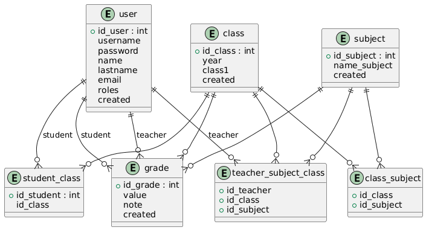

# Žiacka knižka

Webová aplikácia na evidenciu známok žiakov v škole.

Projekt je kontajnerizovaný pomocou Dockeru a nasadený do Kubernetes clusteru
v Azure (AKS). Databázová vrstva je riešená pomocou MariaDB.

---

## Použité technológie

- Node.js (Express)
- MariaDB
- Docker
- Kubernetes (Azure AKS)
- Terraform (infrastruktúra v Azure)

---

## Architektúra

- **Frontend + Backend**: Node.js aplikácia (Express)
- **Databáza**: MariaDB bežiaca v Kubernetes
- **Nasadenie**: Kubernetes Deployment + Service (LoadBalancer)
- **Cloud**: Azure Kubernetes Service (AKS)
- **Infrastruktúra**: definovaná pomocou Terraform

---

## Docker image

Aplikácia je zabalená do Docker image a publikovaná v Docker Hub:

## Nasadenie do Kubernetes (AKS) 

Aplikácia je nasadená v Kubernetes clusteri pomocou Deploymentu
a sprístupnená cez Service typu `LoadBalancer`.

Databáza MariaDB beží ako samostatný Deployment a je inicializovaná
pomocou SQL skriptu `init_cms.sql`, ktorý:

- vytvorí databázovú štruktúru
- naplní databázu testovacími dátami

Aplikácia sa k databáze pripája pomocou environment premenných:

## .env
DB_HOST=cms-db
DB_USER=cms
DB_PASSWORD=Heslo123
DB_DATABASE=cms

---

## Databázový model

## Funkčnosť aplikácie
- prihlasovanie používateľov
- role: admin / učiteľ / žiak
- evidencia tried a predmetov
- zadávanie a prehliadanie známok
- perzistentné dáta uložené v MariaDB

## Údaje ku každému uživatelovi na vyskúšanie úćtu

Ako admin ma prihlasovacie údaje

username: admin
heslo: 1

1.A

| username | heslo    | meno   | priezvisko | rola |
| -------- | -------- | ------ | ---------- | ---- |
| ziak01   | heslo123 | Adam   | Novák      | ziak |
| ziak02   | heslo123 | Martin | Kováč      | ziak |
| ziak03   | heslo123 | Peter  | Horváth    | ziak |
| ziak04   | heslo123 | Lukáš  | Tóth       | ziak |
| ziak05   | heslo123 | Michal | Szabó      | ziak |
| ziak06   | heslo123 | Tomáš  | Baláž      | ziak |
| ziak07   | heslo123 | Filip  | Polák      | ziak |
| ziak08   | heslo123 | Juraj  | Král       | ziak |
| ziak09   | heslo123 | Samuel | Benko      | ziak |
| ziak10   | heslo123 | Jakub  | Urban      | ziak |

1.B

| username | heslo    | meno    | priezvisko | rola |
| -------- | -------- | ------- | ---------- | ---- |
| ziak11   | heslo123 | Dominik | Blaško     | ziak |
| ziak12   | heslo123 | Marek   | Hruška     | ziak |
| ziak13   | heslo123 | Andrej  | Klement    | ziak |
| ziak14   | heslo123 | Oliver  | Hudec      | ziak |
| ziak15   | heslo123 | Daniel  | Bartoš     | ziak |
| ziak16   | heslo123 | Patrik  | Varga      | ziak |
| ziak17   | heslo123 | Matej   | Pavlík     | ziak |
| ziak18   | heslo123 | Erik    | Kučera     | ziak |
| ziak19   | heslo123 | Roman   | Gajdoš     | ziak |
| ziak20   | heslo123 | Šimon   | Farkaš     | ziak |

1.C

| username | heslo    | meno      | priezvisko | rola |
| -------- | -------- | --------- | ---------- | ---- |
| ziak21   | heslo123 | Viktor    | Mihálik    | ziak |
| ziak22   | heslo123 | Denis     | Krupa      | ziak |
| ziak23   | heslo123 | Alex      | Lipták     | ziak |
| ziak24   | heslo123 | Tobias    | Božík      | ziak |
| ziak25   | heslo123 | Richard   | Ondrejka   | ziak |
| ziak26   | heslo123 | Sebastián | Ilavský    | ziak |
| ziak27   | heslo123 | Matúš     | Švec       | ziak |
| ziak28   | heslo123 | Karol     | Černý      | ziak |
| ziak29   | heslo123 | Róbert    | Daniš      | ziak |
| ziak30   | heslo123 | Norbert   | Hlinka     | ziak |

Učitelia

| username | heslo     | meno     | priezvisko | predmet |  rola   |
| -------- | --------- | -------- | ---------- |---------| ------- |
| ucitel01 | ucitel123 | Ján      | Mráz       | Mat.    |  ucitel |
| ucitel02 | ucitel123 | Mária    | Holubová   | Inf.    |  ucitel |
| ucitel03 | ucitel123 | Peter    | Šimko      | Sj.     |  ucitel |
| ucitel04 | ucitel123 | Zuzana   | Kováčová   | Geo.	   |  ucitel |
| ucitel05 | ucitel123 | Ivan     | Beňo       | Dej.	   |  ucitel |
| ucitel06 | ucitel123 | Katarína | Jurčeková  | Tv.	    |  ucitel |
| ucitel07 | ucitel123 | Michal   | Ferenc     | Che.	   |  ucitel |

